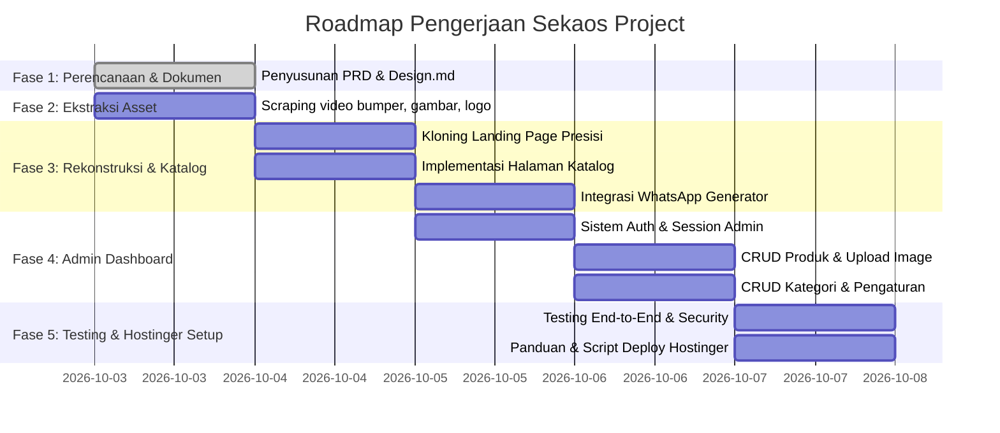

# Product Requirements Document (PRD)
## Proyek: Rekonstruksi & Pengembangan Website Sekaos Project (Katalog & Admin Dashboard)

---

| Metadata | Informasi |
| :--- | :--- |
| **Nama Proyek** | Sekaos Project Web Reconstruction & Catalog Enhancement |
| **Klien** | SEKAOS PROJECT (Vendor Konveksi & Sablon Semarang) |
| **Target Hosting** | Hostinger Premium Web Hosting (`public_html` / Static React Export) |
| **Tech Stack** | **Frontend**: React (Vite) + Vanilla/Modern CSS **Backend/BaaS**: Supabase (PostgreSQL, Storage CDN, Auth) **Deployment**: Git / Build `dist/` ke Hostinger |
| **Sumber Referensi** | [sekaosproject.netlify.app](https://sekaosproject.netlify.app/) |
| **Dokumen Terkait** | [design.md](file:///c:/SMT%207/Sekaos/design.md) |
| **Status Dokumen** | **Disetujui / Selesai Di-Setup** |
| **Tanggal Pembuatan** | 3 Oktober 2026 |

---

## 1. Ringkasan Eksekutif & Latar Belakang

### 1.1 Latar Belakang
**SEKAOS PROJECT** adalah vendor konveksi dan sablon terpercaya asal Semarang yang melayani pembuatan pakaian dan perlengkapan identitas custom untuk event, organisasi, instansi, komunitas, maupun kampus (Rompi, PDH, Kaos, Jersey, Seragam, ID Card, Medali, Totebag, dll).

Saat ini, website resmi Sekaos Project berada di Netlify ([sekaosproject.netlify.app](https://sekaosproject.netlify.app/)) dalam bentuk landing page statis tanpa source code repositori asli yang tersedia bagi tim pengembang saat ini. Website tersebut memiliki keterbatasan:
1. **Tidak Memiliki Fitur Katalog Dinamis**: Calon klien hanya bisa melihat 10 card icon layanan generik dan 9 foto portofolio statis, tanpa detail produk, spesifikasi bahan, maupun variasi custom.
2. **Tidak Ada Dashboard Pengelolaan Konten (Admin Panel)**: Setiap pembaruan portofolio atau produk harus mengedit file HTML secara manual.
3. **Kebutuhan Migrasi Hosting**: Klien menginginkan website dipindahkan dan di-hosting mandiri di layanan Hostinger milik klien (dengan integrasi Git deployment ke `public_html`).

### 1.2 Tujuan Proyek
1. **Ekstraksi & Replikasi Presisi (100% Fidelity)**: Mengambil seluruh aset asli (video bumper, background hero, portofolio, logo, copy teks) dan merekonstruksi landing page agar identik dan responsif.
2. **Penambahan Fitur Katalog Barang (Showcase Display Only)**:
   - Menyediakan etalase produk custom yang interaktif, memiliki filter kategori dan pencarian.
   - **TIDAK MENGGUNAKAN** transaksi checkout atau keranjang belanja online (bukan e-commerce), melainkan sistem **Lead Generation** via tombol **"Konsultasi / Tanya via WhatsApp"** yang langsung terisi otomatis sesuai nama produk yang dilihat.
3. **Pengembangan Admin Dashboard Mandiri**:
   - Sistem login admin yang aman.
   - Manajemen produk (CRUD) beserta upload foto, spesifikasi bahan, minimum order, dan status tayang.
   - Manajemen kategori produk.
   - Pengaturan kontak WhatsApp dan profil perusahaan.
4. **Deployability & Stabilitas Tinggi di Hostinger**: Arsitektur dirancang seringan dan sestabil mungkin untuk berjalan optimal pada Hostinger Premium Web Hosting (`public_html` + MySQL + PHP 8.x) tanpa downtime dan konfigurasi server yang rumit.

---

## 2. Target Pengguna & User Persona

### 2.1 Persona 1: Calon Klien / Pengunjung (Front-end Visitor)
- **Profil**: Ketua panitia event kampus, bendahara komunitas motor, staf HR perusahaan, atau perwakilan organisasi mahasiswa.
- **Karakteristik & Kebutuhan**:
  - Mengakses website mayoritas melalui Smartphone (Instagram Bio / TikTok / Ads).
  - Ingin melihat contoh produk nyata (apakah Sekaos bisa membuat PDH bordir, jersey printing, atau rompi lapangan).
  - Ingin mengetahui spesifikasi bahan (misal: American Drill, Dryfit, Cotton Combed 24s) dan estimasi minimum order.
  - Ingin proses cepat: sekali klik tombol pada produk yang disukai, langsung membuka chat WhatsApp admin dengan pesan yang sudah terisi otomatis nama produk tersebut.

### 2.2 Persona 2: Admin / Owner Sekaos (Back-end Operator)
- **Profil**: Owner atau tim marketing SEKAOS PROJECT.
- **Karakteristik & Kebutuhan**:
  - Membutuhkan antarmuka yang bersih, cepat, dan mudah dipahami tanpa perlu mengerti bahasa pemrograman.
  - Ingin mudah mengunggah foto hasil produksi terbaru dari ponsel/laptop ke katalog.
  - Ingin dapat menonaktifkan atau menandai produk unggulan (*featured*) agar langsung tampil di beranda utama.
  - Ingin mengganti nomor WhatsApp atau link media sosial kapan saja jika ada perubahan nomor CS.

---

## 3. Ruang Lingkup Proyek (Scope of Work)

### 3.1 In-Scope (Termasuk dalam Pengerjaan)
1. **Scraping & Penyelamatan Aset Asli**:
   - Logo resmi Sekaos Project (`WhatsApp Image 2026-06-26 at 22.17.51.jpeg`).
   - Hero background gambar beresolusi tinggi (`hero_bg.png`).
   - Video teaser bumper resmi beresolusi tinggi (`buatkan_vidio_bumper_yang_kere.mp4`).
   - Sembilan (9) foto portofolio asli.
   - Seluruh styling warna brand (`#1A365D`, font Outfit, icon FontAwesome).
2. **Landing Page Enhancement**:
   - Mempertahankan seluruh section original: Navbar, Hero dengan animasi zoom, Video Bumper Player, Layanan Spesialis (10 item), Keunggulan (6 item), Portofolio Grid, Closing Statement, WhatsApp & Instagram CTA, Google Maps interaktif, Footer.
   - **Section Baru di Landing Page**: "Katalog Produk Pilihan / Unggulan" dengan slider atau grid interaktif dan tombol "Lihat Semua Katalog".
3. **Halaman Katalog Lengkap (`/katalog` atau `/catalog`)**:
   - Filter tab kategori (Semua, Rompi/Vest, PDH/Kemeja, Kaos, Jersey, Seragam, Merchandise).
   - Fitur pencarian instan (*live search* berdasarkan nama dan deskripsi).
   - Card produk informatif (Gambar, Judul, Kategori badge, Cuplikan bahan).
   - Modal Pop-up / Halaman Detail Produk: Spesifikasi lengkap, pilihan bahan, minimum order, galeri foto, dan tombol aksi "Tanya Produk via WhatsApp".
4. **WhatsApp Lead Generator**:
   - Link otomatis dinamis dengan format pesan:  
     `https://api.whatsapp.com/send?phone=6289671830693&text=Halo%20Admin%20Sekaos%20Project,%20saya%20tertarik%20dengan%20produk%20[NAMA_PRODUK].%20Bisa%20konsultasi%20bahan%20dan%20harganya?`
5. **Admin Dashboard (`/admin`)**:
   - Login dengan enkripsi password standar industri (Bcrypt/Argon2).
   - Halaman Ringkasan (Total Produk, Total Kategori, Total Kunjungan Produk).
   - Modul Manajemen Produk: Tambah, Edit, Hapus, Upload Foto (auto resize & kompresi WebP), toggle status draft/publish, toggle produk unggulan.
   - Modul Manajemen Kategori: Tambah, Ubah, Hapus, Urutan prioritas.
   - Modul Pengaturan Kontak & Profil: Update nomor WhatsApp CS, teks sambutan, link Instagram, alamat Google Maps.
6. **Optimasi Deployment Hostinger**:
   - Struktur folder siap di-push ke Git repo Hostinger atau upload via File Manager / FTP.
   - Database MySQL schema + seeder awal berisi data katalog sample konveksi.

### 3.2 Out-of-Scope (Tidak Termasuk)
- Sistem keranjang belanja online (*Add to Cart*), checkout multi-item, dan Payment Gateway (Midtrans/Xendit/dll).
- Kalkulator ongkos kirim otomatis (ekspedisi JNE/J&T/dll).
- Pendaftaran akun untuk pengunjung publik (hanya ada akun khusus Admin).

---

## 4. Kebutuhan Fungsional (Functional Requirements)

| ID | Modul | Deskripsi Kebutuhan | Prioritas |
| :--- | :--- | :--- | :--- |
| **FR-01** | Landing Page | Menampilkan landing page yang 100% identik dengan desain Sekaos Netlify termasuk video bumper player otomatis dan navigasi responsif. | P0 (Must Have) |
| **FR-02** | Display Showcase | Menampilkan produk-produk konveksi dalam format card grid modern di landing page dan halaman katalog lengkap. | P0 (Must Have) |
| **FR-03** | Filter & Search | Pengunjung dapat menyaring produk berdasarkan kategori dan mengetikkan kata kunci pencarian secara instan. | P0 (Must Have) |
| **FR-04** | Detail Produk | Pengunjung dapat melihat informasi detail spesifikasi bahan, kelebihan, min. order, dan galeri foto produk. | P0 (Must Have) |
| **FR-05** | WA Direct Inquiry | Tombol CTA pada setiap item produk yang secara otomatis membuka WhatsApp admin dengan pesan spesifik produk terkait. | P0 (Must Have) |
| **FR-06** | Autentikasi Admin | Fitur login admin dengan proteksi session, CSRF token, pembatasan percobaan login (brute force protection), dan logout aman. | P0 (Must Have) |
| **FR-07** | CRUD Produk | Admin dapat membuat produk baru, menyunting data produk, menghapus produk, serta mengatur badge "Unggulan / Featured". | P0 (Must Have) |
| **FR-08** | Image Processing | Sistem secara otomatis memvalidasi jenis file (JPG/PNG/WEBP), menolak script berbahaya, me-rename file secara aman, dan mengompresi gambar untuk kecepatan web. | P1 (High) |
| **FR-09** | CRUD Kategori | Admin dapat menambah, mengubah nama/slug, dan menghapus kategori katalog. | P1 (High) |
| **FR-10** | Pengaturan Website | Admin dapat mengubah nomor kontak WhatsApp, pesan default WhatsApp, akun Instagram, dan teks penutup tanpa menyentuh kode program. | P1 (High) |

---

## 5. Kebutuhan Non-Fungsional (Non-Functional Requirements)

### 5.1 Performa & Kecepatan (Performance)
- **Waktu Muat (Page Load Time)**: Target LCP (Largest Contentful Paint) < 2 detik pada koneksi 4G standar.
- **Media Optimization**: Video bumper dimuat dengan strategi `preload="metadata"` dan poster preview agar tidak membebani kuota data pengunjung sebelum ditekan atau terlihat di layar.
- **Gambar Terkompresi**: Format gambar dikonversi atau disajikan dalam format WebP modern untuk efisiensi bandwidth.

### 5.2 Kompatibilitas Hosting (Hostinger Shared/Premium Compatibility)
- Mendukung arsitektur **LiteSpeed Web Server / Apache** dengan konfigurasi `.htaccess`.
- Menggunakan bahasa pemrograman **PHP 8.1 / 8.2 / 8.3** dan **MySQL / MariaDB** yang tersedia out-of-the-box di hPanel Hostinger.
- Konfigurasi database terpusat melalui file konfigurasi lingkungan (`config.php` / `.env`).

### 5.3 Keamanan (Security)
- **SQL Injection Prevention**: Menggunakan PDO (*PHP Data Objects*) dengan *Prepared Statements* pada seluruh query database.
- **XSS Prevention**: Melakukan *escaping* `htmlspecialchars()` pada seluruh output teks yang dimasukkan user/admin.
- **CSRF Protection**: Token verifikasi form pada setiap aksi mutasi data di Admin Dashboard.
- **Password Security**: Menggunakan fungsi standar `password_hash()` dengan algoritma Bcrypt (COST = 12) atau Argon2ID.
- **File Upload Security**: Pengecekan *MIME-Type* riil, sanitasi ekstensi, dan pembatasan ukuran file maksimal 5 MB.

### 5.4 Antarmuka & Aksesibilitas (UI/UX)
- 100% Mobile Responsive (Breakpoints: 320px, 480px, 768px, 992px, 1200px).
- Font tipografi menggunakan Outfit (Google Fonts) dengan fallback sans-serif.
- Konsistensi warna Navy Blue (`#1A365D`) sebagai identitas utama Sekaos Project.

---

## 6. Kriteria Penerimaan (Acceptance Criteria)

1. **Uji Replikasi Landing Page**:
   - Halaman depan memuat seluruh teks, logo, styling, video bumper, dan portofolio persis seperti web Netlify aslinya.
   - Navigasi menu (Video Bumper, Konveksi Semarang, Portofolio, Kontak) berfungsi mulus dengan *smooth scroll*.
2. **Uji Fitur Katalog**:
   - Produk yang ditambahkan melalui Admin Dashboard langsung muncul di etalase publik.
   - Filter kategori dan search box menampilkan hasil yang tepat secara real-time.
   - Mengklik tombol WhatsApp pada produk "Rompi Tactical Custom" membuka WhatsApp dengan teks pre-filled: `"Halo Admin Sekaos Project, saya tertarik dengan produk Rompi Tactical Custom..."`.
3. **Uji Admin Dashboard**:
   - Halaman `/admin` tidak dapat diakses tanpa login.
   - Admin berhasil login, mengunggah foto baru, mengisi judul & deskripsi, lalu menyimpannya.
   - Fitur edit dan hapus produk berjalan normal tanpa error.
4. **Uji Deployment Hostinger**:
   - Seluruh source code dapat diletakkan di `public_html` Hostinger dan berjalan langsung tanpa error 500.
   - Koneksi database MySQL berhasil terhubung dan query berjalan lancar.

---

## 7. Tahapan Pengerjaan (Roadmap)

