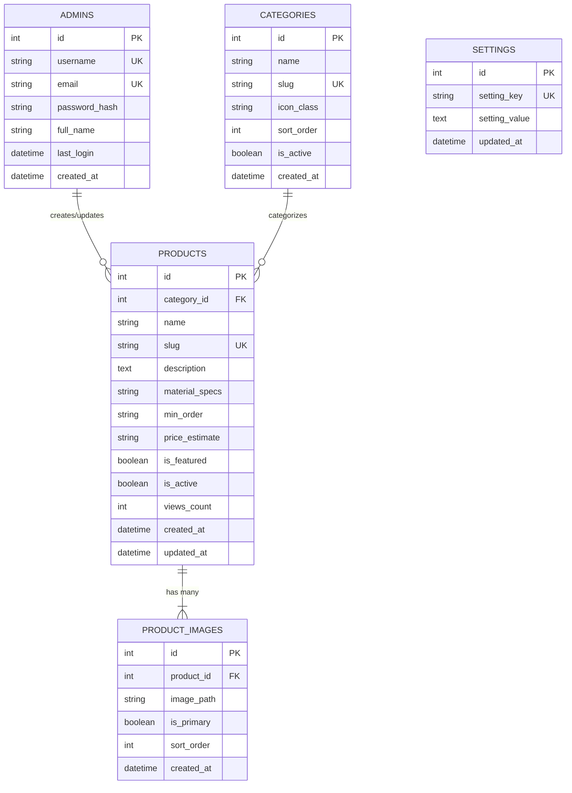
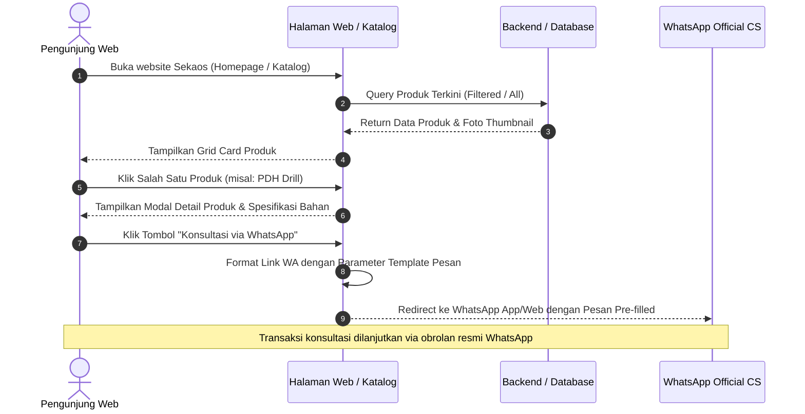
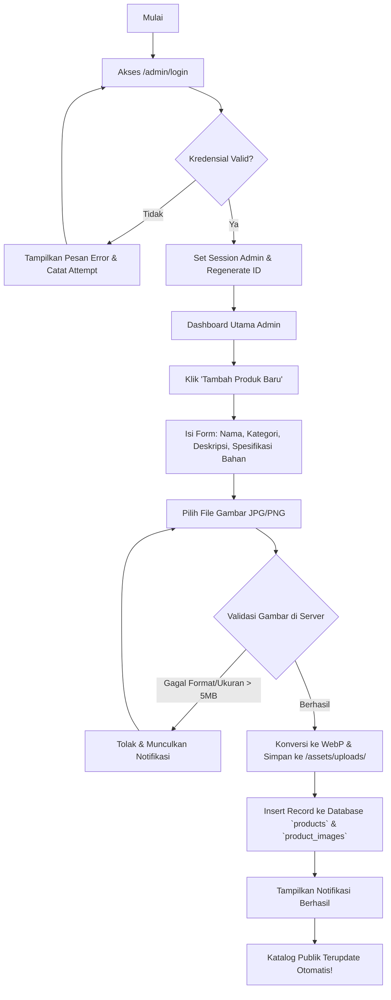

# Design Specification & System Architecture
## Proyek: Rekonstruksi & Pengembangan Website Sekaos Project

---

| Metadata | Rincian |
| :--- | :--- |
| **Proyek** | Sekaos Project (Landing Page, Dynamic Catalog, Admin Panel) |
| **Target Platform** | Hostinger Premium Web Hosting (`public_html` / LiteSpeed / PHP 8.x / MySQL) |
| **Dokumen Terkait** | [PRD.md](file:///c:/SMT%207/Sekaos/PRD.md) |
| **Status Dokumen** | **Disetujui / Blueprint Implementasi** |
| **Terakhir Diperbarui** | 3 Oktober 2026 |

---

## 1. Analisis Lingkungan Hosting (Hostinger Ecosystem)

Berdasarkan spesifikasi akun hosting klien pada Hostinger hPanel:
- **Paket Hosting**: Premium Web Hosting.
- **Web Server**: LiteSpeed Web Server dengan dukungan `.htaccess` & LiteSpeed Cache (LSCache).
- **Runtime & Database**: PHP versi 8.1 / 8.2 / 8.3 dan MariaDB / MySQL Database via phpMyAdmin.
- **Mekanisme Deployment**:
  - Fitur **Git Deployment** otomatis dari remote Git repository ke direktori `public_html` (seperti yang sudah berjalan pada repositori `sebaris.id` di cabang `hosting`).
  - Mendukung alternatif akses via **File Manager** dan **FTP/SFTP**.
- **Karakteristik Resource**: RAM teralokasi sekitar 1 - 2 GB, CPU throttle limit CloudLinux LVE.

### Keputusan Pemilihan Stack Teknologi (Architecture Decision)
| Kriteria | Opsi A: Modern PHP 8.x + MySQL + Vanilla Modern JS (Dipilih) | Opsi B: Node.js / Next.js Fullstack |
| :--- | :--- | :--- |
| **Kompatibilitas Hostinger Shared** | **100% Native & Optimal**. Langsung berjalan tanpa setup PM2/Daemon. | Sering mengalami limitasi port, sleep mode, dan memori pada shared hosting. |
| **Performa & Konsumsi Memori** | **Sangat Ringan (< 30 MB RAM)**. Waktu respon LiteSpeed sangat instan. | Konsumsi RAM tinggi (> 150 MB), risiko 503 Service Unavailable jika limit kena. |
| **Kemudahan Maintenance Klien** | **Sangat Mudah**. Klien non-teknisi bisa backup database via phpMyAdmin. | Memerlukan rebuild script dan restart daemon server jika ada update. |
| **Kecepatan Deployment Git** | **Instan**. Cukup `git pull` langsung aktif di `public_html`. | Memerlukan pipeline build (`npm install && npm run build`) di server. |

> **Rekomendasi Arsitektur**: Menggunakan **Modern PHP 8.x (Clean MVC-style Architecture) + MySQL (PDO Prepared Statements) + Vanilla Modern CSS/JS** dengan template engine native yang rapi, cepat, dan modular.

---

## 2. Arsitektur Folder Proyek (Directory Structure)

Struktur direktori dirancang agar bersih, memisahkan logika backend dan aset publik, serta dapat langsung di-deploy ke root `public_html` Hostinger:

```text
c:\SMT 7\Sekaos\
├── .htaccess                   # URL rewrite, proteksi folder sensitif, LSCache header
├── config/
│   ├── database.php            # Koneksi database PDO terpusat (singleton)
│   └── app.php                 # Konstanta URL dasar, nama web, dan environment
├── database/
│   ├── schema.sql              # Struktur tabel DDL lengkap
│   └── seeders.sql             # Data awal katalog sample (PDH, Rompi, Kaos, dll)
├── includes/
│   ├── auth.php                # Middleware proteksi session admin & CSRF token
│   ├── functions.php           # Helper: sanitasi XSS, auto-slug, uploader gambar WebP
│   ├── header.php              # Header & navigasi publik yang dapat digunakan ulang
│   └── footer.php              # Footer publik & modal inquiry
├── assets/
│   ├── css/
│   │   ├── style.css           # Styling utama landing page (retained & enhanced)
│   │   └── catalog.css         # Styling halaman katalog, filter badge & modal
│   ├── js/
│   │   ├── app.js              # Interaktivitas navbar, smooth scroll, video bumper
│   │   └── catalog.js          # Live search katalog, filter kategori, auto-WA generator
│   ├── images/
│   │   ├── logo.jpeg           # Logo asli Sekaos Project
│   │   ├── hero_bg.png         # Background hero asli
│   │   ├── portfolio/          # 9 foto portofolio asli
│   │   └── default-product.jpg # Placeholder fallback produk
│   ├── uploads/                # Direktori penyimpanan foto produk admin
│   │   └── .htaccess           # Proteksi: blokir eksekusi script PHP di folder upload
│   └── videos/
│       └── buatkan_vidio_bumper_yang_kere.mp4 # Video bumper resmi asli
├── admin/                      # Portal Admin Dashboard
│   ├── index.php               # Dashboard overview & metrik statistik ringkas
│   ├── login.php               # Halaman login admin yang elegan
│   ├── logout.php              # Script destroy session aman
│   ├── products.php            # Tabel data produk (datatable interaktif)
│   ├── product-create.php      # Form tambah produk baru + multi image upload
│   ├── product-edit.php        # Form edit produk & status
│   ├── product-delete.php      # Handler hapus produk (termasuk unlink file fisik)
│   ├── categories.php          # CRUD kategori produk
│   ├── settings.php            # Pengaturan nomor WA, template pesan, profil
│   └── assets/
│       ├── css/admin.css       # Styling dashboard bernuansa dark/modern professional
│       └── js/admin.js         # Preview gambar live, konfirmasi dialog modal
├── index.php                   # Landing Page utama (+ section Featured Catalog)
├── katalog.php                 # Halaman Katalog Lengkap dengan Filter & Live Search
├── detail-produk.php           # Halaman Detail Produk mandiri (SEO friendly)
└── api/
    └── products.php            # REST endpoint internal untuk live search AJAX
```

---

## 3. Skema Basis Data (Database Design & ERD)

### 3.1 Entity Relationship Diagram (ERD)



### 3.2 Data Dictionary (Spesifikasi Tabel)

#### Tabel 1: `admins`
Menyimpan kredensial operator admin dashboard.
| Kolom | Tipe Data | Keterangan |
| :--- | :--- | :--- |
| `id` | INT AUTO_INCREMENT PRIMARY KEY | Identitas unik admin |
| `username` | VARCHAR(50) NOT NULL UNIQUE | Username login (misal: `adminsekaos`) |
| `email` | VARCHAR(100) NOT NULL UNIQUE | Email pemulihan |
| `password_hash` | VARCHAR(255) NOT NULL | Hash password menggunakan `PASSWORD_BCRYPT` |
| `full_name` | VARCHAR(100) NOT NULL | Nama lengkap admin / pengelola |
| `last_login` | DATETIME NULL | Waktu login terakhir |
| `created_at` | DATETIME DEFAULT CURRENT_TIMESTAMP | Waktu akun dibuat |

#### Tabel 2: `categories`
Menyimpan kategori pakaian konveksi.
| Kolom | Tipe Data | Keterangan |
| :--- | :--- | :--- |
| `id` | INT AUTO_INCREMENT PRIMARY KEY | ID kategori |
| `name` | VARCHAR(100) NOT NULL | Nama kategori (contoh: "Rompi & Vest", "PDH & Kemeja") |
| `slug` | VARCHAR(100) NOT NULL UNIQUE | URL slug SEO (`rompi-vest`, `pdh-kemeja`) |
| `icon_class` | VARCHAR(50) DEFAULT 'fas fa-tshirt' | Icon FontAwesome pendukung |
| `sort_order` | INT DEFAULT 0 | Urutan tampilan pada tab filter |
| `is_active` | TINYINT(1) DEFAULT 1 | 1 = Aktif, 0 = Nonaktif |
| `created_at` | DATETIME DEFAULT CURRENT_TIMESTAMP | Tanggal pembuatan |

#### Tabel 3: `products`
Menyimpan entitas barang/produk display konveksi.
| Kolom | Tipe Data | Keterangan |
| :--- | :--- | :--- |
| `id` | INT AUTO_INCREMENT PRIMARY KEY | ID produk |
| `category_id` | INT NOT NULL | Foreign key relasi ke `categories.id` |
| `name` | VARCHAR(200) NOT NULL | Nama produk (misal: "Rompi Tactical Lapangan 4 Saku") |
| `slug` | VARCHAR(220) NOT NULL UNIQUE | Slug URL ramah SEO |
| `description` | TEXT NULL | Deskripsi lengkap, detail jahitan, dan keunggulan |
| `material_specs` | VARCHAR(255) NULL | Ringkasan bahan (misal: "Ripstop Drill / Parasut WP") |
| `min_order` | VARCHAR(50) DEFAULT '12 pcs' | Minimal pemesanan (opsional teks bebas) |
| `price_estimate` | VARCHAR(100) NULL | Estimasi harga / label "Hubungi CS untuk Penawaran" |
| `is_featured` | TINYINT(1) DEFAULT 0 | 1 = Tampil di Landing Page depan, 0 = Hanya di katalog |
| `is_active` | TINYINT(1) DEFAULT 1 | 1 = Dipublikasikan, 0 = Draft |
| `views_count` | INT DEFAULT 0 | Metrik jumlah klik / penayangan produk |
| `created_at` | DATETIME DEFAULT CURRENT_TIMESTAMP | Waktu input produk |
| `updated_at` | DATETIME ON UPDATE CURRENT_TIMESTAMP | Waktu modifikasi terakhir |

#### Tabel 4: `product_images`
Menyimpan galeri foto produk (1 produk bisa memiliki beberapa foto sudut pandang).
| Kolom | Tipe Data | Keterangan |
| :--- | :--- | :--- |
| `id` | INT AUTO_INCREMENT PRIMARY KEY | ID foto |
| `product_id` | INT NOT NULL (FK ON DELETE CASCADE) | ID produk pemilik foto |
| `image_path` | VARCHAR(255) NOT NULL | Path relatif file foto (misal: `assets/uploads/rompi-1.webp`) |
| `is_primary` | TINYINT(1) DEFAULT 0 | 1 = Foto utama (thumbnail), 0 = Galeri pelengkap |
| `sort_order` | INT DEFAULT 0 | Urutan tampil foto di galeri |
| `created_at` | DATETIME DEFAULT CURRENT_TIMESTAMP | Tanggal upload |

#### Tabel 5: `settings`
Menyimpan pengaturan konfigurasi dinamis website.
| Kolom | Tipe Data | Keterangan |
| :--- | :--- | :--- |
| `id` | INT AUTO_INCREMENT PRIMARY KEY | ID konfigurasi |
| `setting_key` | VARCHAR(50) NOT NULL UNIQUE | Kunci identifikasi (contoh: `whatsapp_number`) |
| `setting_value` | TEXT NOT NULL | Nilai konfigurasi |
| `updated_at` | DATETIME ON UPDATE CURRENT_TIMESTAMP | Tanggal update |

*Data Awal `settings`:*
- `whatsapp_number`: `6289671830693`
- `whatsapp_template`: `Halo Admin Sekaos Project, saya ingin konsultasi pemesanan custom produk: {product_name}. Bisa minta detail bahan dan estimasi harganya?`
- `instagram_username`: `sekaos.project`
- `instagram_url`: `https://instagram.com/sekaos.project`
- `address_city`: `Semarang, Jawa Tengah`
- `maps_url`: `https://maps.app.goo.gl/SPYvU4N9ifpcvq6f9`

---

## 4. Alur Kerja Sistem (System Workflows)

### 4.1 Alur Pengunjung: Eksplorasi Katalog & Tanya via WhatsApp



### 4.2 Alur Admin: Manajemen Produk & Unggah Gambar



---

## 5. Desain UI/UX & Design Tokens

### 5.1 Design Tokens (Palet Warna & Tipografi)

```css
:root {
    /* Brand Colors (Presisi dari Web Netlify Asli) */
    --primary-color: #1A365D;        /* Navy Blue Khas Sekaos */
    --primary-dark: #0F2547;         /* Navy Lebih Gelap untuk Hover/Header */
    --primary-light: #2A4E7E;        /* Navy Aksen Terang */
    --secondary-color: #1A1A1A;      /* Charcoal Black untuk Heading & Footer */
    --accent-blue: #38BDF8;          /* Sky Blue (Aksen Divider Bumper) */
    
    /* Functional Colors */
    --whatsapp-color: #25D366;       /* WhatsApp Brand Green */
    --whatsapp-hover: #1EBE5A;
    --instagram-grad: linear-gradient(45deg, #f09433 0%, #e6683c 25%, #dc2743 50%, #cc2366 75%, #bc1888 100%);
    --badge-featured: #f59e0b;       /* Amber Gold untuk Produk Unggulan */
    --status-draft: #ef4444;         /* Red */
    
    /* Neutrals & Surfaces */
    --bg-light: #F8F9FA;             /* Abu-abu terang background */
    --bg-white: #FFFFFF;
    --text-color: #333333;           /* Charcoal Text Body */
    --text-light: #666666;
    --border-color: #E2E8F0;
    
    /* Shadows & Border Radius */
    --radius-sm: 8px;
    --radius-md: 12px;
    --radius-lg: 20px;
    --radius-pill: 50px;
    --shadow-card: 0 4px 20px rgba(0, 0, 0, 0.06);
    --shadow-hover: 0 12px 30px rgba(26, 54, 93, 0.15);
    --transition: all 0.3s cubic-bezier(0.4, 0, 0.2, 1);
}
```

### 5.2 Desain Komponen Publik Baru

#### A. Pill Filter Kategori & Search Bar
- **Search Bar**: Input pencarian melayang dengan ikon pencarian `fas fa-search`, debounce 300ms untuk memfilter produk tanpa reload.
- **Kategori Tabs**: Tombol berbentuk pil dengan status `active` bernuansa Navy Blue bergradasi, memudahkan pengunjung smartphone memilih kategori produk dengan satu sentuhan ibu jari.

#### B. Product Card Component
- **Badge Kategori**: Melayang di pojok kiri atas card.
- **Badge "Populer / Unggulan"**: Jika `is_featured = 1`, menampilkan bintang emas.
- **Thumbnail Image**: Rasio 4:3 dengan efek hover zoom halus (`transform: scale(1.05)`).
- **Info Singkat**:
  - Judul Produk (Bold, max 2 baris).
  - Spesifikasi Bahan (misal: `<i class="fas fa-layer-group"></i> Nagata Drill`).
  - Minimum Order (misal: `<i class="fas fa-boxes"></i> Min. 12 pcs`).
- **Tombol WhatsApp**: Tombol lebar hijau khas WhatsApp berbunyi:  
  **`[ <i class="fab fa-whatsapp"></i> Tanya Produk Ini ]`**

#### C. Modal Detail Produk
- Menampilkan galeri foto dengan navigasi thumbnail.
- Deskripsi lengkap mengenai opsi bordir komputer, variasi sablon DTF/Plastisol, jenis kancing, dan ukuran.
- Tombol Aksi Utama: "Konsultasi WhatsApp Sekarang" dengan auto-direct.

### 5.3 Desain Antarmuka Admin Dashboard

Admin Dashboard dirancang dengan estetika modern bergaya SaaS:
- **Sidebar Kiri**:
  - Logo Sekaos Project dengan indikator `Admin Panel`.
  - Menu Navigasi:
    - `Dashboard` (`fas fa-tachometer-alt`)
    - `Katalog Produk` (`fas fa-box-open`)
    - `Kategori` (`fas fa-tags`)
    - `Pengaturan Web` (`fas fa-cog`)
    - `Lihat Website Publik` (`fas fa-external-link-alt`)
    - `Keluar / Logout` (`fas fa-sign-out-alt`)
- **Main Content**:
  - Kartu Ringkasan (Cards): Total Produk Aktif, Total Kategori, Produk Unggulan.
  - Tabel Produk: Dilengkapi thumbnail foto, nama produk, kategori badge, switch toggle aktif/nonaktif, dan tombol aksi (Edit, Hapus dengan konfirmasi modal).
  - Form Input: Dilengkapi fitur **Drag & Drop Image Upload** dan **Live Image Preview**.

---

## 6. Strategi Ekstraksi & Penyelamatan Aset (Scraping Blueprint)

Seluruh aset akan diambil langsung dari URL Netlify asli (`https://sekaosproject.netlify.app/`) dan disimpan di folder lokal:

| Asset Name | Tipe | URL Sumber Netlify | Tujuan Path Lokal |
| :--- | :--- | :--- | :--- |
| **Logo Sekaos** | Gambar JPEG | `https://sekaosproject.netlify.app/WhatsApp Image 2026-06-26 at 22.17.51.jpeg` | `assets/images/logo.jpeg` |
| **Hero Background** | Gambar PNG | `https://sekaosproject.netlify.app/hero_bg.png` | `assets/images/hero_bg.png` |
| **Video Bumper** | Video MP4 | `https://sekaosproject.netlify.app/buatkan_vidio_bumper_yang_kere.mp4` | `assets/videos/bumper.mp4` |
| **Portofolio 1 - 9** | Gambar JPEG | `https://sekaosproject.netlify.app/WhatsApp Image 2026-06-26 at 22.17.59 (1).jpeg` s/d `...01.jpeg` | `assets/images/portfolio/porto-1.jpg` s/d `porto-9.jpg` |
| **CSS Stylesheet** | CSS | `https://sekaosproject.netlify.app/style.css` | `assets/css/style.css` |

---

## 7. Arsitektur Keamanan & Proteksi Hostinger

1. **Proteksi Folder Unggahan (`assets/uploads/.htaccess`)**:
   Mencegah penyerang mengunggah file PHP berbahaya ke dalam folder gambar publik:
   ```apache
   # Matikan eksekusi script PHP di direktori uploads
   <FilesMatch "\.(php|phtml|php3|php4|php5|php7|phps)$">
       Order Deny,Allow
       Deny from all
   </FilesMatch>
   Options -Indexes -ExecCGI
   ```
2. **Session Hardening**:
   ```php
   ini_set('session.cookie_httponly', 1);
   ini_set('session.use_only_cookies', 1);
   ini_set('session.cookie_samesite', 'Strict');
   if (isset($_SERVER['HTTPS']) && $_SERVER['HTTPS'] === 'on') {
       ini_set('session.cookie_secure', 1);
   }
   ```
3. **Database Security (PDO Prepared Statements)**:
   Semua query SELECT, INSERT, UPDATE, DELETE menggunakan binding parameter untuk menjamin kekebalan terhadap serangan SQL Injection.
4. **Validasi File Unggah**:
   - Pengecekan ekstensi: Hanya mengizinkan `.jpg`, `.jpeg`, `.png`, `.webp`.
   - Validasi MIME-type riil dengan `finfo_file()`.
   - Re-encode gambar dan konversi otomatis menjadi format `.webp` yang bersih dari metadata EXIF/script berbahaya.

---

## 8. Panduan Siap-Deploy ke Hostinger (Hostinger Deployment Guide)

1. **Konfigurasi Git Deployment di Hostinger hPanel**:
   - Buka menu **Git** di hPanel Hostinger.
   - Sambungkan dengan repositori GitHub/GitLab proyek.
   - Set cabang (Branch): `main` atau `hosting`.
   - Set direktori root instalasi: `/public_html`.
2. **Setup Database**:
   - Buka menu **Database MySQL** di hPanel, buat database baru (misal: `u123456_sekaos`) beserta usernya.
   - Buka **phpMyAdmin**, import file `database/schema.sql` dan `database/seeders.sql`.
   - Sesuaikan kredensial di file `config/database.php`.
3. **Selesai**: Website langsung tayang dan dapat diperbarui secara berkelanjutan via `git push`.
